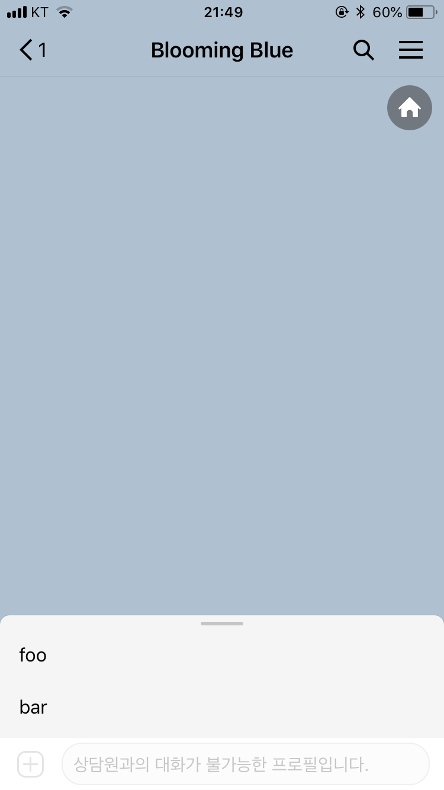
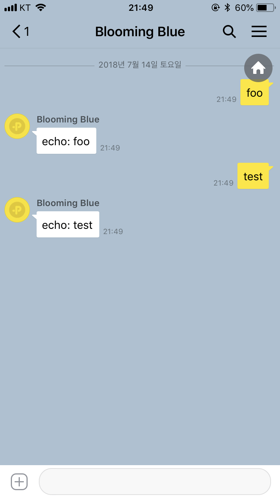

# django-rest-kakao-auto-reply

[](https://travis-ci.org/iamchanii/django-rest-kakao-auto-reply) [](https://codecov.io/gh/iamchanii/django-rest-kakao-auto-reply)

카카오톡 플러스 친구 자동응답 API(이하 자동응답 API)를 Django + DRF로 만들 때 쉽게 만들 수 있도록 해주는 패키지입니다. 패키지에서 제공하는 ViewSet과 Router, Decorator를 사용하면 쉽고 빠르게 자동응답 API를 만들 수 있습니다. 이제 플러스친구로 무엇을 만들지에 대해서만 집중하세요.

## Requirements
- Python >= 3.6
- Django >= 2
- djangorestframework 

## Quick Start

1. 패키지를 설치합니다. `pip`를 사용해서 간단하게 설치할 수 있습니다.

    ```bash
    (venv) $ pip install django-rest-kakao-auto-reply
    ```
    
2. `KakaoAutoReplyViewSet`를 상속받는 새로운 ViewSet을 만듭니다. 아래 코드를 참고하세요.

    ```python
    from kakao_auto_reply import objects, decorators
    from kakao_auto_reply.viewsets import KakaoAutoReplyViewSet
    from rest_framework.response import Response
    
    class MyViewSet(KakaoAutoReplyViewSet):
        def on_keyboard(self, request, *args, **kwargs):
            data = objects.Keyboard(type='buttons',
                                    buttons=['foo', 'bar'])
    
            return Response(data, 200)
    
        @decorators.on_message_parse
        def on_message(self, request, *args, **kwargs):
            content = kwargs['content']
            message = objects.Message(text='echo: %s' % content)
            keyboard = objects.Keyboard(type='text')
            data = objects.MessageResponse(message, keyboard)
    
            return Response(data, 200)
    ``` 

3. `urls`에 `KakaoAutoReplyRouter`를 가져와서 새로운 라우터를 생성하고, 위에서 만든 `MyViewSet`을 등록합니다.

    ```python
    from django.urls import path, include
    from kakao_auto_reply.routers import KakaoAutoReplyRouter
    from .viewsets import MyViewSet
    
    router = KakaoAutoReplyRouter()
    router.register('', MyViewSet, base_name='foo')
    
    urlpatterns = [
        path('kakaobot/', include(router.urls)),
    ]
    ```
    
4. 끝.

    
    

## Documentation

### viewsets

#### KakaoAutoReplyViewSet

카카오톡 플러스친구 자동응답 API 에서 구현해야 하는 함수를 미리 정리 해 둔 ViewSet 입니다. 해당 ViewSet 을 상속받은 ViewSet 은 아래 명시된 5개의 메소드를 구현해야 합니다.

- `def on_keyboard(self, request, *args, **kwargs):`

    - Home Keyboard API에 해당합니다.

- `def on_message(self, request, *args, **kwargs):`

    - 메시지 수신 및 자동응답 API에 해당합니다. `@on_message_parse` 데코레이터를 사용해야 합니다.

- `def on_friend_added(self, request, *args, **kwargs):`

    - 친구 추가 API에 해당합니다. `@on_friend_added_parse` 데코레이터를 사용해야 합니다.

- `def on_friend_deleted(self, request, *args, **kwargs):`

    - 친구 차단 API에 해당합니다. `@on_friend_deleted_parse` 데코레이터를 사용해야 합니다.

- `def on_chatroom_leaved(self, request, *args, **kwargs):`

    - 채팅방 나가기 API에 해당합니다. `@on_chatroom_leaved_parse` 데코레이터를 사용해야 합니다.

### decorators

### @on_message_parse

- 메시지 수신 및 자동응답 API가 호출 될 때 Request Body로 전달 된 `user_key`, `type`, `content`를 가져와 `**kwargs`에 전달합니다.

### @on_friend_added_parse

- 친구 추가 API가 호출 될 때 Request Body로 전달 된 `user_key`를 가져와 `**kwargs`에 전달합니다.

### @on_friend_deleted_parse / @on_chatroom_leaved_parse

- 각각 친구 차단/채팅방 나가기 API가 호출 될 때 주소 Parameter로 넘어온 `user_key`를 가져와 `**kwargs`에 전달합니다.

### objects

카카오톡 자동응답 API 구현에 필요한 Object를 생성하여 반환하는 함수 목록입니다.

- MessageResponse
    - parameter
        - message **(required)**
        - keyboard
    - example
        ```python
        MessageResponse(message, keyboard)

        """:returns:"""
        {
            'message': message,
            'keyboard': keyboard,
        }
        ```
- Keyboard
    - parameter
        - type **(required)**
            - text
            - buttons
        - buttons
    - example
        ```python
        Keyboard(type, buttons)

        """:returns:"""
        {
            'type': type,
            'buttons': buttons,
        }
        ```
- Message
    - parameter
        - text
        - photo
        - message_button
    - example
        ```python
        Message(text, photo, message_button)

        """:returns:"""
        {
            'text': text,
            'photo': photo,
            'message_button': message_button,
        }
        ```
- Photo
    - parameter
        - url **(required)**
        - width **(required)**
        - height **(required)**
    - example
        ```python
        Photo(url, width, height)

        """:returns:"""
        {
            'url': url,
            'width': width,
            'height': height,
        }
        ```
- MessageButton
    - parameter
        - label **(required)**
        - url **(required)**
    - example
        ```python
        Photo(label, url)

        """:returns:"""
        {
            'label': label,
            'url': url,
        }
        ```

### routers

자동응답 API 스펙에 맞게 작성된 커스텀 라우터입니다.

## Contributors

-